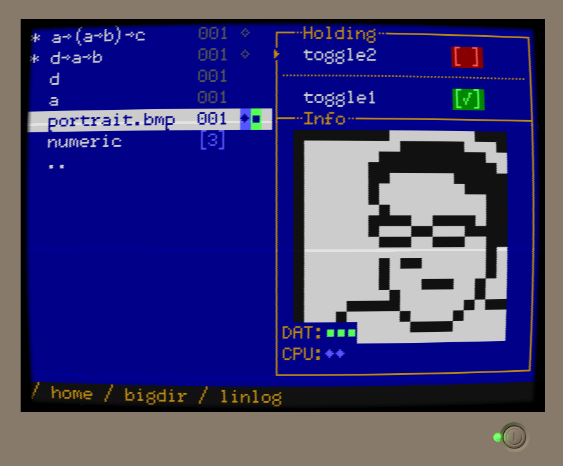

upsilon-draft
=============

This is a prototype of a game idea drawing some inspiration from

 - [factorio](https://en.wikipedia.org/wiki/Factorio)
 - [TIS-100](https://en.wikipedia.org/wiki/TIS-100) & other zachtronics games
 - [Orteil's "Nested"](https://orteil.dashnet.org/nested)
 - [Quadrilateral Cowboy](https://en.wikipedia.org/wiki/Quadrilateral_Cowboy)
 - [smalltalk](https://en.wikipedia.org/wiki/Smalltalk)-style reflection
 - [uxn](https://100r.co/site/uxn.html)

Thanks to @dwrensha and @tom7 for ideas.

Demo
----

[](https://jcreedcmu.github.io/upsilon-draft/)

Demo available here: https://jcreedcmu.github.io/upsilon-draft/

This is built and deployed by [this github actions workflow](https://github.com/jcreedcmu/upsilon-draft/blob/main/.github/workflows/static.yml).

Development
----------

In one shell, you can
```shell
make watch
```
to build the js bundle and in another
```shell
make serve
```
to start a local server on port 8000.

Browse to http://localhost:8000 to play the game.
